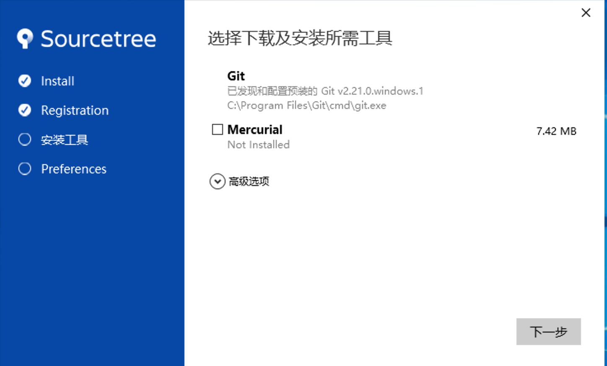
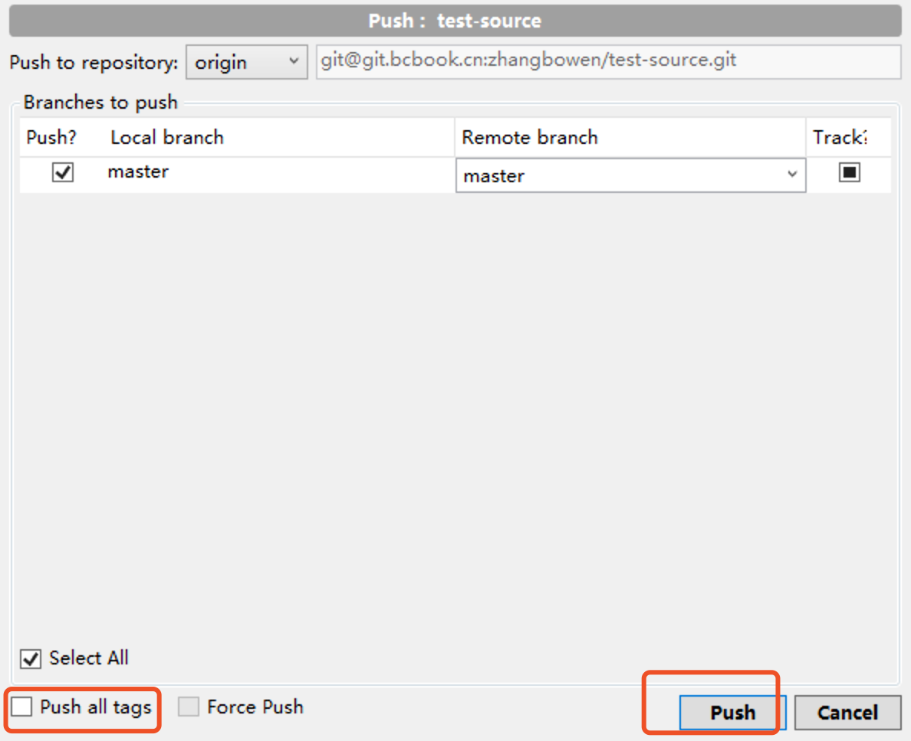

# SourceTree

SourceTree是一个Git的图形化工具。它简化了我们与Git存储库交互的方式，使开发人员可以专注于编码（而不是在解决冲突）。它的功能远不止一个UI，可以查看官网了解更多。

图形化工具的使用不是意味着放弃命令，相反地想要熟练的使用图形化工具仍然需要对git命令的了解。

# 安装
[下载地址](https://www.sourcetreeapp.com/)

## 注册账号
下载完成打开，进入初始化页面。选择Create One for Free在弹出的页面注册账号：


## 登录

注册账号并验证邮箱，完成后关闭页面。回到初始化页面，点击Bitbucket在弹出的页面进行登录：


## 初始化配置

登录成功点击下一步，进入配置页面，我们使用系统已经安装的Git，此处不需要勾选Mercurial，点击下一步：


## 密钥配置

配置完成后，sourcetree会提示我们是否创建密钥，我们使用自己的密钥，这里选择否，进入主页面：


在顶部工具栏中依次点击工具->选项。


选择一般选项卡，在ssh客户端的选项中，选择OpenSSH，如果此时已经安装并配置过git，则会自动填充ssh密钥的路径。


## no-ff
我们需要开启提交时默认使用no-ff的形式，在git选项卡中，勾选：


## 语言
默认sourcetree使用的是中文页面，由于某些命令在翻译成中文后难以理解，建议还是将界面修改为英文，修改后重启sourcetree即可：


## 用户名邮箱修改
在选项->一般选项卡中，修改用户名与邮箱为姓名全拼和公司邮箱。


## 冲突解决工具

如果我们已经安装了svn，建议使用tortoiseMerge作为冲突合并工具。在options->diff中修改diff和merge工具：


# 仓库导入
## 远程仓库导入
拿到git的ssh地址，如：

```
git@git.bcbook.cn:whdx_ms/whdx-framework-project.git
```

选择clone选项卡，将地址填充，选择要clone到本地的路径，点击clone即可：


## 本地存在的仓库

如果本地已经存在git仓库（含有.git隐藏文件的目录），我们可以直接导入，使用sourcetree进行管理。
选择Add选项卡，填充本地路径，点击Add即可：


# 版本管理
## 拉取
在左侧remotes节点中可以看到远程全部的分支，双击即可拉取到本地，在左侧BRANCHES中展示本地的分支。


我们双击可以切换本地的分支，并且可以点击Pull拉取最新的推送：


## 提交

本地修改后，可以在Working Copy中查看修改，并且进行提交，默认情况下提交操作是提交到git的本地仓库，并不会推送到远端：


选择Stage暂存到将要提交的文件列表中：


输入本次提交的注释，点击commit即可。
如果在下面勾选了Push，会同时推送到远端。


## 推送

当我们进行commit操作后，本地分支与Push按钮上均会出现未推送到远端的提交数量。

我们选择Push推送到远端：

在弹出的取消push tag选项，点击push按钮推送：

